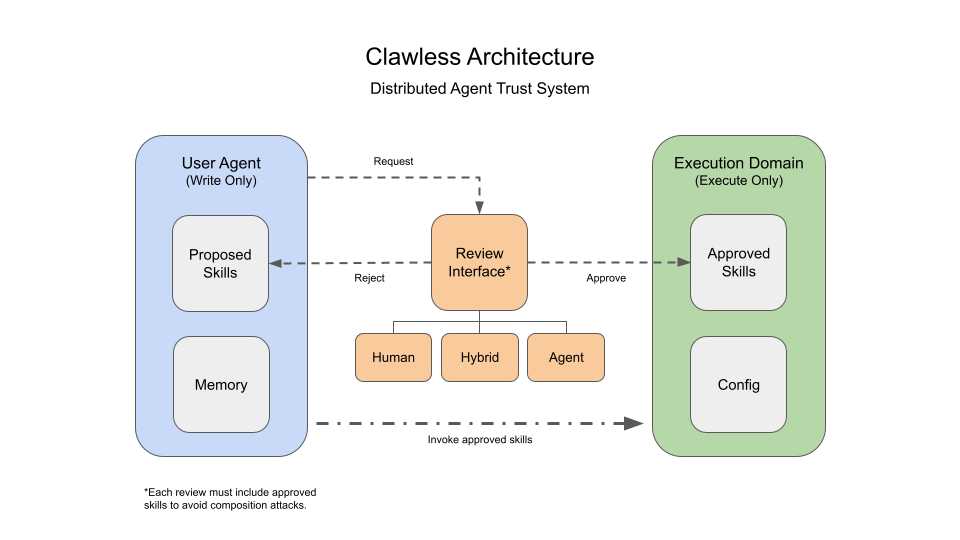

<p align="center">
  
  <br>
  <em>Clawless runs flawless!</em>
</p>

# Clawless

A safety-first agent framework where **everything is a skill**. Designed for high-safety contexts — regulated enterprise assistants, education, and family companions.

The running agent can **never** modify its own code, configuration, or active skills. All persistent changes are either per-profile memory (append-only JSONL) or human-approved skill proposals. Hence the name: *Clawless*.

## How It Works

<p align="center">
  
</p>

Clawless splits into two processes with different privilege levels:

```
User ──→ [User Agent (cl-bot)]  ──→  YAML proposal  ──→  [Admin Service (cl-admin)]  ──→  [Human Admin]
          low privilege            structured spec      has system access               final gate
          no code gen              no code              implements + analyzes           approve/reject
```

The **user agent** starts minimal — just enough to communicate via CLI and propose new skills. Users ask it to learn new capabilities ("learn how to use voice"), which become structured YAML proposals. The **admin service** implements the code, runs safety analysis, and presents it for human approval. Only then does the skill get installed and activate on the next restart.

## Quick Start

```bash
# Clone and install
git clone https://github.com/youruser/clawless.git
cd clawless
python -m venv .venv
source .venv/bin/activate
pip install -e .

# Configure an LLM endpoint
cp config/default.yaml.example config/default.yaml
# Edit config/default.yaml — set your API key:
#   api_key: "${OPENAI_API_KEY}"
# Then export the env var:
export OPENAI_API_KEY="sk-..."

# Run the user agent
cl-bot
```

## Architecture

The core agent is a minimal **kernel** that dispatches events between skills and enforces capability tokens. All user-facing behavior lives in skills:

| Skill | What it does | Capabilities |
|-------|-------------|-------------|
| `cli` | stdin/stdout I/O loop — reads input, prints output | `user:input`, `user:output` |
| `reasoning` | Conversation pipeline — prompt building, LLM calls, tool execution, capability gap detection | `llm:call`, `memory:read`, `memory:write` |
| `memory` | Stores/retrieves facts, preferences, persona adjustments (JSONL) | `memory:read`, `memory:write`, `llm:call` |
| `skill-proposer` | Generates YAML skill proposals from user requests (never code) | `llm:call`, `file:write` |

Skills communicate via **events** dispatched through the kernel. No skill holds a direct reference to another. The kernel enforces **capability tokens** at runtime — a skill can only dispatch events requiring capabilities it has declared.

### Tool-Based Skill Architecture

Skills expose functionality to the LLM via **tools** (function calling). Each skill can provide `BaseTool` subclasses with typed parameter schemas. At startup, the kernel collects all tool schemas from the registry and passes them to the LLM. When the user's request matches a tool's purpose, the LLM calls it directly with appropriate parameters — including context from conversation history and user memories.

The reasoning skill runs a **tool-calling loop**: the LLM can invoke tools, receive results, and continue reasoning for up to 3 iterations per turn. This works across both OpenAI-compatible and Anthropic API providers.

### Two-Agent Trust Model

**User Agent** (`cl-bot`) — low privilege, user-facing. Knows only abstract system capabilities ("audio_input available", not device paths). Produces YAML proposals, never code. Even fully compromised, it can only output structured specs.

**Admin Service** (`cl-admin`) — privileged, not user-facing. Has full system access. Generates implementations from specs, runs AST safety analysis + composition checks, presents the full package for human approval. On acceptance, the admin service installs the skill (copies code into the skills directory, updates the manifest) so it activates on the next agent restart.

```bash
# Start the admin service (polls for new proposals, interactive CLI)
cl-admin

# Or process pending proposals once and exit
cl-admin --once
```

The admin service provides an **interactive CLI** during the polling loop:

| Command | Description |
|---------|-------------|
| `list [STATUS]` | List proposals, optionally filtered by status |
| `approve <ID\|SLUG> [--force]` | Approve a proposal for installation |
| `help` | Show available commands |

### Proposal Pipeline

```
new → discovered → implementation → agent-review → human-review → accepted/rejected
```

Each status transition can be configured in `config/admin.yaml` to require human approval (`human`) or proceed automatically (`auto`). The `human-review` gate always requires human approval by default.

Proposals that the LLM determines are impossible to implement within the security constraints are automatically rejected as **infeasible**, with a reason logged in the proposal file.

## Configuration

| File | Purpose |
|------|---------|
| `config/default.yaml` | LLM endpoints, safety, memory settings |
| `config/system_profile.yaml` | Abstract system capabilities (what the user agent sees) |
| `config/skills_manifest.yaml` | Skill allowlist — loaded at startup, frozen |
| `config/admin.yaml` | Admin service: gate config, poll interval, mode |

API keys use `${ENV_VAR}` syntax — the LLM router resolves them from environment variables at runtime. Never commit actual keys.

## Project Structure

```
src/
├── user/                     # User agent (low privilege)
│   ├── main.py               # Entry point: cl-bot
│   ├── kernel.py             # Event dispatcher + boot + tool dispatch
│   ├── types.py              # Event, KernelContext, SystemProfile
│   ├── config.py             # Settings + system profile loading
│   ├── guard.py              # Input/output safety filtering
│   ├── sandbox.py            # Path write enforcement
│   ├── llm.py                # LLM router + providers (OpenAI + Anthropic)
│   └── skills/
│       ├── base.py           # BaseSkill, BaseTool, SkillRegistry
│       ├── cli/              # CLI communication (pure I/O)
│       ├── reasoning/        # Conversation pipeline + tool-calling loop
│       ├── memory/           # Memory skill (manager + extractor)
│       └── proposer/         # YAML-only proposal generation
│
└── admin/                    # Admin service (privileged)
    ├── main.py               # Entry point: cl-admin
    ├── service.py            # Pipeline loop + gate checks + interactive CLI
    ├── implementer.py        # Code generation from spec (tool-aware)
    ├── analyzer.py           # AST safety + composition checks
    └── notifier.py           # Notifier ABC + CLINotifier
```

See [docs/PROJECT.md](docs/PROJECT.md) for the full design document.

## Security Invariants

1. User agent writes only to `profiles/` and `proposals/` within the data directory
2. No `eval`/`exec`/`subprocess` in the user agent — only `importlib` for manifest loading at startup
3. Code + config + skills are read-only after startup (registry is frozen)
4. Skill activation requires the full admin pipeline + human approval
5. The user agent never generates code and never sees system implementation details
6. Admin service is a separate process — never callable from within the user agent
7. Generated skill code is validated against forbidden imports/builtins before acceptance
8. Core skills (`cli`, `reasoning`, `memory`, `proposer`) cannot be removed via the admin CLI

## Target Hardware

Raspberry Pi 4 + ReSpeaker 2-Mic HAT (voice added as a skill via the proposal pipeline).

## License

MIT
